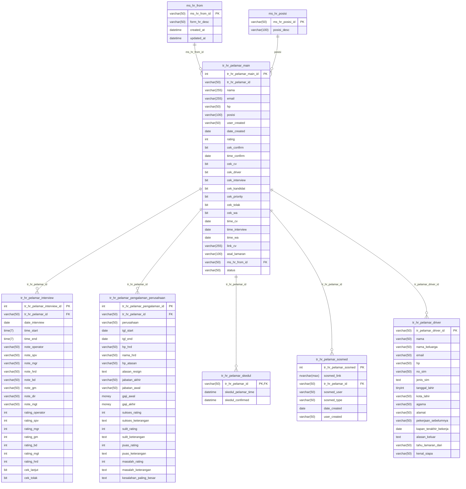

## Entity Relationship Diagram (ERD)

# Data Dictionary / Database Schema

---

## Tabel: tr_hr_pelamar_main
| Kolom                 | Tipe         | Nullable | Deskripsi                                    |
|-----------------------|--------------|----------|-----------------------------------------------|
| tr_hr_pelamar_main_id | int          | No       | Primary key, auto increment                   |
| tr_hr_pelamar_id      | varchar(50)  | Yes      | ID pelamar (opsional, untuk integrasi eksternal) |
| nama                  | varchar(255) | No       | Nama pelamar                                 |
| email                 | varchar(255) | No       | Email pelamar                                |
| hp                    | varchar(50)  | Yes      | Nomor HP pelamar                             |
| posisi                | varchar(100) | Yes      | Posisi/jabatan yang dilamar                  |
| user_created          | varchar(50)  | Yes      | User yang membuat data                       |
| date_created          | date         | Yes      | Tanggal data dibuat                          |
| rating                | int          | Yes      | Rating pelamar (opsional)                    |
| cek_confirm           | bit          | Yes      | Status konfirmasi interview                   |
| time_confirm          | date         | Yes      | Waktu konfirmasi interview                   |
| cek_cv                | bit          | Yes      | Status kelengkapan CV                        |
| cek_driver            | bit          | Yes      | Status kelengkapan driver                    |
| cek_interview         | bit          | Yes      | Status interview                             |
| cek_kandidat          | bit          | Yes      | Status kandidat                              |
| cek_priority          | bit          | Yes      | Status prioritas                             |
| cek_tolak             | bit          | Yes      | Status tolak                                 |
| cek_wa                | bit          | Yes      | Status pengiriman WhatsApp                   |
| time_cv               | date         | Yes      | Waktu upload CV                              |
| time_interview        | date         | Yes      | Waktu interview                              |
| time_wa               | date         | Yes      | Waktu pengiriman WhatsApp                    |
| link_cv               | varchar(255) | Yes      | Link ke file CV                              |
| asal_lamaran          | varchar(100) | Yes      | Asal lamaran (opsional, jika tidak pakai master) |
| ms_hr_from_id         | varchar(50)  | Yes      | ID asal lamaran (relasi ke ms_hr_from)       |
| status                | varchar(50)  | Yes      | Status pelamar                               |

---

## Tabel: tr_hr_pelamar_interview
| Kolom                      | Tipe         | Nullable | Deskripsi                        |
|----------------------------|--------------|----------|-----------------------------------|
| tr_hr_pelamar_interview_id | int          | No       | Primary key                      |
| tr_hr_pelamar_id           | varchar(50)  | Yes      | Foreign key ke pelamar           |
| date_interview             | date         | Yes      | Tanggal interview                |
| time_start                 | time(7)      | Yes      | Waktu mulai                      |
| time_end                   | time(7)      | Yes      | Waktu selesai                    |
| note_operator              | varchar(50)  | Yes      | Catatan operator                 |
| note_spv                   | varchar(50)  | Yes      | Catatan supervisor               |
| note_mgr                   | varchar(50)  | Yes      | Catatan manager                  |
| note_hrd                   | varchar(50)  | Yes      | Catatan HRD                      |
| note_bd                    | varchar(50)  | Yes      | Catatan board director           |
| note_gm                    | varchar(50)  | Yes      | Catatan general manager          |
| note_dir                   | varchar(50)  | Yes      | Catatan direktur                 |
| note_mgt                   | varchar(50)  | Yes      | Catatan manajemen                |
| rating_operator            | int          | Yes      | Rating operator                  |
| rating_spv                 | int          | Yes      | Rating supervisor                |
| rating_mgr                 | int          | Yes      | Rating manager                   |
| rating_gm                  | int          | Yes      | Rating general manager           |
| rating_bd                  | int          | Yes      | Rating board director            |
| rating_mgt                 | int          | Yes      | Rating manajemen                 |
| rating_hrd                 | int          | Yes      | Rating HRD                       |
| cek_lanjut                 | bit          | Yes      | Flag lanjut proses                |
| cek_tolak                  | bit          | Yes      | Flag tolak proses                 |

---

## Tabel: tr_hr_pelamar_pengalaman_perusahaan
| Kolom                      | Tipe         | Nullable | Deskripsi                                    |
|----------------------------|--------------|----------|-----------------------------------------------|
| tr_hr_pelamar_pengalaman_id| int (IDENTITY) | No     | Primary key, auto increment                   |
| tr_hr_pelamar_id           | varchar(50)  | No       | Foreign key ke pelamar                        |
| perusahaan                 | varchar(50)  | No       | Nama perusahaan                               |
| tgl_start                  | date         | No       | Tanggal mulai bekerja                         |
| tgl_end                    | date         | No       | Tanggal selesai bekerja                       |
| hp_hrd                     | varchar(50)  | No       | Nomor HP HRD perusahaan                       |
| nama_hrd                   | varchar(50)  | No       | Nama HRD perusahaan                           |
| hp_atasan                  | varchar(50)  | No       | Nomor HP atasan langsung                      |
| alasan_resign              | text         | No       | Alasan resign dari perusahaan                  |
| jabatan_akhir              | varchar(50)  | Yes      | Jabatan terakhir di perusahaan                 |
| jabatan_awal               | varchar(50)  | Yes      | Jabatan awal di perusahaan                     |
| gaji_awal                  | money        | No       | Gaji awal saat masuk perusahaan                |
| gaji_akhir                 | money        | No       | Gaji akhir saat keluar perusahaan              |
| sukses_rating              | int          | Yes      | Rating keberhasilan (opsional)                 |
| sukses_keterangan          | text         | Yes      | Keterangan keberhasilan (opsional)             |
| sulit_rating               | int          | Yes      | Rating kesulitan (opsional)                    |
| sulit_keterangan           | text         | Yes      | Keterangan kesulitan (opsional)                |
| puas_rating                | int          | Yes      | Rating kepuasan (opsional)                     |
| puas_keterangan            | text         | Yes      | Keterangan kepuasan (opsional)                 |
| masalah_rating             | int          | Yes      | Rating masalah (opsional)                      |
| masalah_keterangan         | text         | Yes      | Keterangan masalah (opsional)                  |
| kesalahan_paling_besar     | text         | Yes      | Catatan kesalahan paling besar (opsional)      |

---

## Tabel: tr_hr_pelamar_skedul
| Kolom                | Tipe         | Nullable   | Deskripsi                                 |
|----------------------|--------------|------------|---------------------------------------------|
| tr_hr_pelamar_id     | varchar(50)  | No         | Primary key, foreign key ke pelamar         |
| skedul_pelamar_time  | datetime     | Yes        | Waktu skedul interview pelamar (opsional)   |
| skedul_confirmed     | datetime     | Yes        | Waktu konfirmasi skedul oleh pelamar (opsional) |

---

## Tabel: tr_hr_pelamar_sosmed
| Kolom                | Tipe            | Nullable   | Deskripsi                                      |
|----------------------|-----------------|------------|-------------------------------------------------|
| tr_hr_pelamar_sosmed | int             | No         | Primary key, ID sosmed pelamar                   |
| sosmed_link          | nvarchar(max)   | Yes        | Link ke profil sosial media pelamar (opsional)   |
| tr_hr_pelamar_id     | varchar(50)     | Yes        | Foreign key ke pelamar (opsional)                |
| sosmed_user          | varchar(50)     | Yes        | Username/ID akun sosial media (opsional)         |
| sosmed_type          | varchar(50)     | Yes        | Jenis sosial media (misal: Facebook, IG, dsb)    |
| date_created         | date            | Yes        | Tanggal data dibuat (opsional)                   |
| user_created         | varchar(50)     | Yes        | User yang membuat data (opsional)                |

---

## Tabel: tr_hr_pelamar_driver
| Kolom                   | Tipe         | Nullable   | Deskripsi                                      |
|-------------------------|--------------|------------|-------------------------------------------------|
| tr_pelamar_driver_id    | varchar(50)  | No         | Primary key, ID pelamar driver                  |
| nama                    | varchar(50)  | Yes        | Nama pelamar                                    |
| nama_keluarga           | varchar(50)  | Yes        | Nama keluarga                                   |
| email                   | varchar(50)  | Yes        | Email                                           |
| hp                      | varchar(50)  | Yes        | Nomor HP                                        |
| no_sim                  | varchar(50)  | Yes        | Nomor SIM                                       |
| jenis_sim               | text         | Yes        | Jenis SIM (opsional, bisa A/B/C/dll)            |
| tanggal_lahir           | tinyint      | Yes        | Tanggal lahir (opsional, kemungkinan tahun saja) |
| kota_lahir              | varchar(50)  | Yes        | Kota lahir                                      |
| agama                   | varchar(50)  | Yes        | Agama                                           |
| alamat                  | varchar(50)  | Yes        | Alamat                                          |
| pekerjaan_sebelumnya    | varchar(50)  | Yes        | Pekerjaan sebelumnya                            |
| kapan_terakhir_bekerja  | date         | Yes        | Kapan terakhir bekerja (opsional)               |
| alasan_keluar           | text         | Yes        | Alasan keluar dari pekerjaan sebelumnya         |
| tahu_lamaran_dari       | varchar(50)  | Yes        | Sumber info lamaran (teman, iklan, dsb)         |
| kenal_siapa             | varchar(50)  | Yes        | Kenal siapa di perusahaan (opsional)            |

---

## Tabel: ms_hr_from
| Kolom           | Tipe         | Nullable   | Deskripsi                                 |
|-----------------|--------------|------------|---------------------------------------------|
| ms_hr_from_id   | varchar(50)  | No         | Primary key, ID form HRD                   |
| form_hr_desc    | varchar(50)  | Yes        | Deskripsi form HRD (opsional)               |
| created_at      | datetime     | Yes        | Tanggal dibuat (opsional, auto by system)   |
| updated_at      | datetime     | Yes        | Tanggal update terakhir (opsional, auto)    |

---

## Tabel: ms_hr_posisi
| Kolom            | Tipe         | Nullable   | Deskripsi                                 |
|------------------|--------------|------------|---------------------------------------------|
| ms_hr_posisi_id  | varchar(50)  | No         | Primary key, ID posisi/jabatan             |
| posisi_desc      | varchar(100) | Yes        | Nama/deskripsi posisi/jabatan (opsional)   |

---
