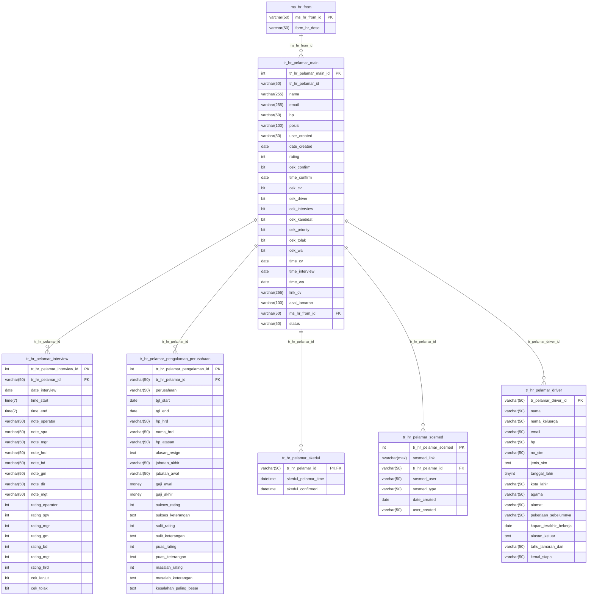

# Entity Relationship Diagram (ERD) - HRD System

```mermaid
erDiagram
    tr_hr_pelamar_main {
        int tr_hr_pelamar_main_id PK
        varchar(50) tr_hr_pelamar_id
        varchar(255) nama
        varchar(255) email
        varchar(50) hp
        varchar(100) posisi
        varchar(50) user_created
        date date_created
        int rating
        bit cek_confirm
        date time_confirm
        bit cek_cv
        bit cek_driver
        bit cek_interview
        bit cek_kandidat
        bit cek_priority
        bit cek_tolak
        bit cek_wa
        date time_cv
        date time_interview
        date time_wa
        varchar(255) link_cv
        varchar(100) asal_lamaran
        varchar(50) ms_hr_from_id FK
        varchar(50) status
    }

    tr_hr_pelamar_interview {
        int tr_hr_pelamar_interview_id PK
        varchar(50) tr_hr_pelamar_id FK
        date date_interview
        time(7) time_start
        time(7) time_end
        varchar(50) note_operator
        varchar(50) note_spv
        varchar(50) note_mgr
        varchar(50) note_hrd
        varchar(50) note_bd
        varchar(50) note_gm
        varchar(50) note_dir
        varchar(50) note_mgt
        int rating_operator
        int rating_spv
        int rating_mgr
        int rating_gm
        int rating_bd
        int rating_mgt
        int rating_hrd
        bit cek_lanjut
        bit cek_tolak
    }

    tr_hr_pelamar_pengalaman_perusahaan {
        int tr_hr_pelamar_pengalaman_id PK
        varchar(50) tr_hr_pelamar_id FK
        varchar(50) perusahaan
        date tgl_start
        date tgl_end
        varchar(50) hp_hrd
        varchar(50) nama_hrd
        varchar(50) hp_atasan
        text alasan_resign
        varchar(50) jabatan_akhir
        varchar(50) jabatan_awal
        money gaji_awal
        money gaji_akhir
        int sukses_rating
        text sukses_keterangan
        int sulit_rating
        text sulit_keterangan
        int puas_rating
        text puas_keterangan
        int masalah_rating
        text masalah_keterangan
        text kesalahan_paling_besar
    }

    tr_hr_pelamar_skedul {
        varchar(50) tr_hr_pelamar_id PK, FK
        datetime skedul_pelamar_time
        datetime skedul_confirmed
    }

    tr_hr_pelamar_sosmed {
        int tr_hr_pelamar_sosmed PK
        nvarchar(max) sosmed_link
        varchar(50) tr_hr_pelamar_id FK
        varchar(50) sosmed_user
        varchar(50) sosmed_type
        date date_created
        varchar(50) user_created
    }

    tr_hr_pelamar_driver {
        varchar(50) tr_pelamar_driver_id PK
        varchar(50) nama
        varchar(50) nama_keluarga
        varchar(50) email
        varchar(50) hp
        varchar(50) no_sim
        text jenis_sim
        tinyint tanggal_lahir
        varchar(50) kota_lahir
        varchar(50) agama
        varchar(50) alamat
        varchar(50) pekerjaan_sebelumnya
        date kapan_terakhir_bekerja
        text alasan_keluar
        varchar(50) tahu_lamaran_dari
        varchar(50) kenal_siapa
    }

    ms_hr_from {
        varchar(50) ms_hr_from_id PK
        varchar(50) form_hr_desc
    }

    tr_hr_pelamar_main ||--o{ tr_hr_pelamar_interview : "tr_hr_pelamar_id"
    tr_hr_pelamar_main ||--o{ tr_hr_pelamar_pengalaman_perusahaan : "tr_hr_pelamar_id"
    tr_hr_pelamar_main ||--o{ tr_hr_pelamar_skedul : "tr_hr_pelamar_id"
    tr_hr_pelamar_main ||--o{ tr_hr_pelamar_sosmed : "tr_hr_pelamar_id"
    tr_hr_pelamar_main ||--o{ tr_hr_pelamar_driver : "tr_pelamar_driver_id"
    ms_hr_from ||--o{ tr_hr_pelamar_main : "ms_hr_from_id"
```
